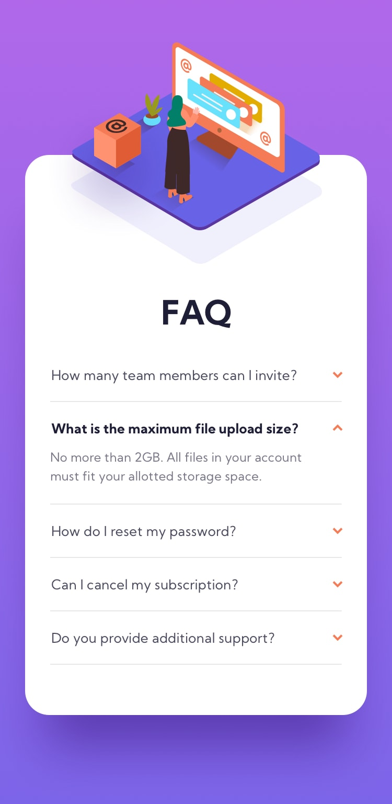

# FAQ-Accordion-Card-Main

This is a solution to the [FAQ-Accordion-Card-Main challenge on Frontend Mentor](https://www.frontendmentor.io/challenges/faq-accordion-card-XlyjD0Oam). Frontend Mentor challenges help you improve your coding skills by building realistic projects. 

## Table of contents

- [Overview](#overview)
  - [Screenshot](#screenshot)
  - [Links](#links)
- [My process](#my-process)
  - [Built with](#built-with)
- [Author](#author)
- [Acknowledgments](#acknowledgments)

## Overview

### Screenshot

### Links

- Solution URL: [Solution](https://github.com/nikamerebashvili95/faq-accordion-card-main)
- Live Site URL: [GitHub Live URL](https://nikamerebashvili95.github.io/faq-accordion-card-main/)

## My process

### Built with

- Semantic HTML5 markup
- CSS custom properties
- Flexbox
- Mobile-first workflow
- Responsive
- Javascript

## Author

- GitHub - [Nika Merebashvili](https://github.com/nikamerebashvili95)

## Acknowledgments

special thanks goes to Otar Zakalshvili, for the opportunity to learn web development

- Oto Zakalashvili: [Linkedin](https://www.linkedin.com/in/otarza/)
- BitCamp: [BitCamp](https://www.facebook.com/groups/bitcamp.ge/permalink/8389844074389186/)
